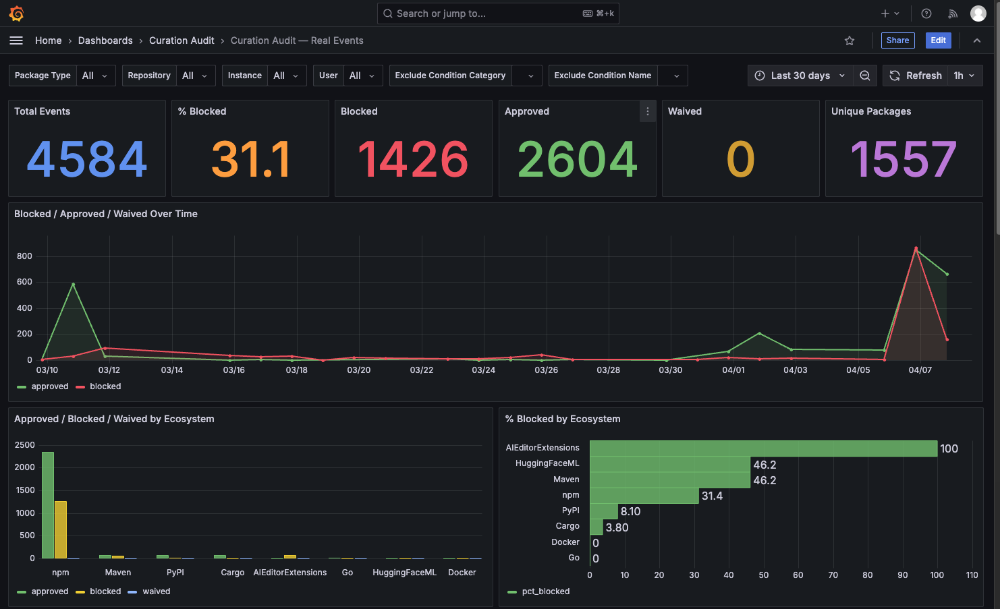

# JFrog Curation Audit Dashboard



A self-contained Docker Compose stack that pulls JFrog Curation audit events into PostgreSQL and visualises them in Grafana. Two pre-built dashboards cover real enforcement events and dry-run (policy simulation) events, giving your security and engineering teams a clear view of what is being blocked, why, and by whom.

---

## Prerequisites

- [Docker Engine 24+](https://docs.docker.com/engine/install/) (or Docker Desktop)
- Docker Compose v2 — verify with `docker compose version`

No Python, Node, or Grafana CLI needed on the host.

---

## Quick Start

```bash
# 1. Clone the repository
git clone <repo-url> && cd <repo-dir>

# 2. Configure your JFrog instance(s)
cp instances.json.example instances.json
# Edit instances.json — add one entry per Artifactory instance (name, url, token)

# 3. (Optional) Configure Grafana password and lookback window
cp .env.example .env
# Edit .env — set GRAFANA_ADMIN_PASSWORD and LOOKBACK_DAYS as needed

# 4. Start the database and Grafana UI
docker compose up -d postgres grafana

# 5. Load audit data
docker compose --profile etl run --rm etl

# 6. Open the dashboard
open http://localhost:3000   # macOS
# or navigate to http://localhost:3000 in any browser
```

Log in with username `admin` and the password set in `GRAFANA_ADMIN_PASSWORD` (default: `admin`). Dashboards are under the **Curation Audit** folder.

> **Why are steps 4 and 5 separate?** The database and UI start once and persist across restarts. The ETL is a one-shot job — run it on demand or schedule it as a cron job. This keeps the always-on services independent from the periodic data fetch.

### Single-instance fallback

If you only have one Artifactory instance and prefer environment variables, skip `instances.json` and set these in `.env` instead:

```
JFROG_URL=https://mycompany.jfrog.io
JFROG_TOKEN=eyJ...
```

The ETL detects the absence of `instances.json` and falls back automatically, using the URL hostname as the instance name.

---

## Dashboard Overview

### Curation Audit — Real Events

Reports on actual enforcement decisions (packages that were blocked, approved, or waived).

| Panel | What it shows |
|---|---|
| Stat row | Total events · % Blocked · Blocked · Approved · Waived · Unique Packages |
| Blocked / Approved / Waived Over Time | Daily trend of all three actions |
| Approved / Blocked / Waived by Ecosystem | Grouped bar chart per package type (npm, PyPI, Maven, …) |
| % Blocked by Ecosystem | Which ecosystems have the highest block rate |
| Top Blocked Packages | Packages blocked most often, with reason |
| Blocked by Condition Category | Pie — security / license / operational breakdown |
| Blocked by Condition Name | Pie — specific policy rule names |
| Policy Breakdown | Table of which policies triggered which blocks |
| Waived by Ecosystem | Packages waived per ecosystem |
| User Activity | Per-user breakdown of approved / blocked / waived events — click a username to drill down |
| High-Persistence Users | Users who tried to download the same blocked package across 3+ separate sessions |
| Persistent Blocked Packages | Packages blocked in more than one 12-hour session window |
| Download Sessions Over Time | New download session starts per day |
| User Events Log | Full event-by-event log for the selected user (last 100 events) |

**Filters:** Instance, Package Type, Repository, User, Exclude Condition Category, Exclude Condition Name, and the Grafana time range picker.

**User drill-down:** Select a user from the **User** dropdown (or click a row in the User Activity table) to filter every panel to that user's events. The User Events Log at the bottom shows their full individual event history.

### Curation Audit — Dry Run

Mirrors the Real Events dashboard but for policy simulation mode (`is_dry_run = true`). Shows what _would_ have been blocked if Curation were enforced — without affecting actual downloads. Useful for validating a new policy before enabling enforcement.

All panels are structurally identical to Real Events. Titles use the "Would-Be…" prefix to distinguish simulated from enforced outcomes. The same Instance and User filters apply.

---

## Re-running the ETL

The ETL uses upsert logic — re-running never creates duplicate records.

**Manual re-run:**
```bash
docker compose --profile etl run --rm etl
```

**Daily cron example** (runs at 02:00, logs to file):
```cron
0 2 * * * cd /path/to/repo && docker compose --profile etl run --rm etl >> /var/log/curation-etl.log 2>&1
```

Set `LOOKBACK_DAYS=2` in `.env` for routine daily runs — it only needs to catch up on the last two days. Use 30–365 for the first historical backfill.

---

## Port Customization

If ports `3000` (Grafana) or `5432` (PostgreSQL) are already in use, create a `docker-compose.override.yml` file in the project root:

```yaml
# docker-compose.override.yml
services:
  grafana:
    ports:
      - "3001:3000"   # change 3001 to any free port
  postgres:
    ports:
      - "5433:5432"
```

Docker Compose automatically merges this file — no `-f` flags needed. Then access Grafana at `http://localhost:3001`.

---

## Data Retention and Resetting

Event data and Grafana settings persist in named Docker volumes across restarts.

**Full reset** (wipes all data and Grafana state — also required after schema changes such as adding multi-instance support):
```bash
docker compose down -v
docker compose up -d postgres grafana
docker compose --profile etl run --rm etl
```

**Wipe only event data** (keep Grafana settings/customisations):
```bash
docker compose exec postgres psql -U audit -c "TRUNCATE audit_events CASCADE;"
docker compose --profile etl run --rm etl
```

---

## Troubleshooting

| Symptom | Cause and fix |
|---|---|
| ETL exits with authentication error | `url` or `token` wrong in `instances.json`; or `JFROG_URL`/`JFROG_TOKEN` not set in `.env` (fallback mode) |
| ETL exits with 400 Bad Request | Check that the instance URL has no trailing slash and the token has Curation read scope |
| ETL ignores `instances.json` | File not found — ensure it is in the project root (same directory as `docker-compose.yml`) |
| Grafana shows "No data" on all panels | ETL has not run yet — execute step 4 |
| Grafana variable dropdowns show errors | ETL has not run yet; or run `docker compose restart grafana` after first ETL load |
| Port already in use | See Port Customization above |
| `docker compose` command not found | Install Docker Compose v2; legacy binary is `docker-compose` (v1) |
